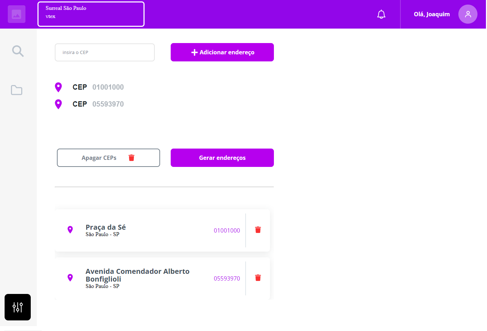

# Consulta CEP

## Desafio front-end.

Esse desafio foi apresentado com layout definido. 

A proposta é a criar uma lista de CEP da cidade de São Paulo, e depois consultar a API ViaCep, e gerar a lista de endereços. 
A tecnologia desenvolvida foi o framework Vue, versão 2. 

Durante o desenvolvimento implementei um botão para limpar a lista de CEP's, 
dessa forma o layout ficou um pouco diferente do proposto.

## Print da tela

